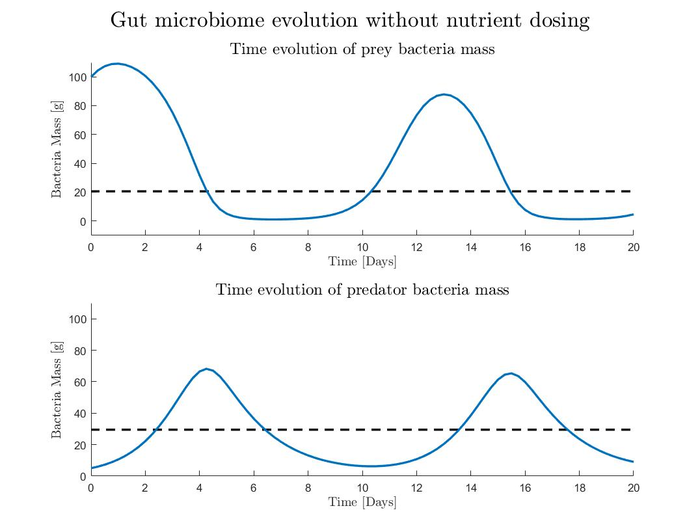

# Implementation of the Model Predictive Control for the regulation of the intestinal bacterial overgrowth

### Introduction
The gut microbiome and the influence of its composition on the overall health and well-being has been getting an increasing attention.

Systems biology and methods of the control theory can give us additional insight into this interesting world of small bugs. 
In these scripts, I outline a way in which the optimal control theory could help us to investigate and deal with
the malfunctioning dynamics of the gut ecosystem. 

Specifically, we look at the loss of microbiota diversity (LOMS), which seems to be the most constant finding of the intestinal dysbiosis,
which often seems to be associated with the modern Western lifestyle and diet [1]. A hypothesis suggests that the LOMS is associated with
the decrease of the population of the bacterial predators in the gut. As the health issues caused by the negative perturbations to the
gut microbiome populations can be quite detrimental, it is worth to think about how we could restore the balance of the bacteria in the gut,
so that the population of the predator bacteria increase. This could perhaps be accomplished by the dietary interventions.

### Dynamics of the uncontrolled system
While the dynamics of the relationship between the small monsters in our gut is quite intricate, here I consider a simplified situation:
We model the dynamics between two bacterial species in the gut, using the Lotka-Volterra predator-prey model adopted from [2]. The states represent the bacterial masses of predator (i. e. *Bdellovibrio bacteriovorus*) and prey (i. e. *Prevotella intermedia*) bacteria.
The input to the system is the change in the basal feeding rate of the prey bacterial species, 
while it is assumed that the predator bacteria are only fed by the prey bacteria. The system is described by the following set of equations.

Where:
* *B* is the prey bacteria mass in the gut [g]
* *P* is the predator bacteria mass in the gut[g] 
 
* *u* is the input representing the modulation of the food source to the bacteria [1/day] 
 
* *r* is the growth rate of prey bacteria [1/day]
* *k* is carrying capacity of prey bacteria, what the population would be if the growth was not limited [g]
* *a* is the interaction term describing how fast the predator bacteria can consume the prey bacteria [1/day]
* *c* is the control of prey consumption rate for low prey bacterial population [g]
* *b* is the growth coefficient of predator bacteria [dimensionless]
* *d* is the mortality rate of predator bacteria [1/day]

We purposefully start with the very low mass of the predator bacteria (5 g) and high mass of the prey bacteria (100 g), out of the equilibrium and we simulate the system with the parameters in the script. 
The time evolution of the system is shown in the figure below, where it is apparent that the system oscillates with a period of roughly 12 days if no input to the system is provided:

In such situation, the bacterial population in the gut fluctuates significantly and predator mass often attains very low levels, what could correspond to the LOMS condition and also the overgrowth of the prey bacteria.

### Model Predictive Control of the predator-prey system
To deal with the 

## References
[1] Mosca, A., Leclerc, M., & Hugot, J. P. (2016). Gut Microbiota Diversity and Human Diseases: Should We Reintroduce Key Predators in Our Ecosystem? Frontiers in Microbiology, 7, 455. https://doi.org/10.3389/fmicb.2016.00455  
[2] Åström, K. J., & Murray, R. M. (2008). Feedback Systems (1st ed.). Princeton: Princeton University Press. Retrieved from http://press.princeton.edu/titles/8701.html.
